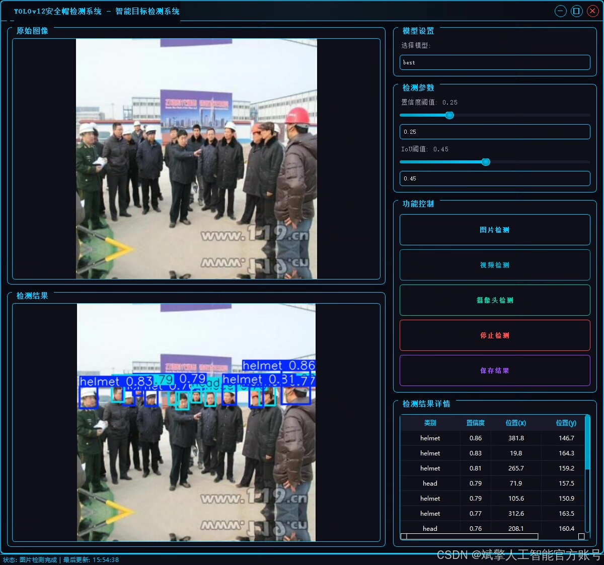
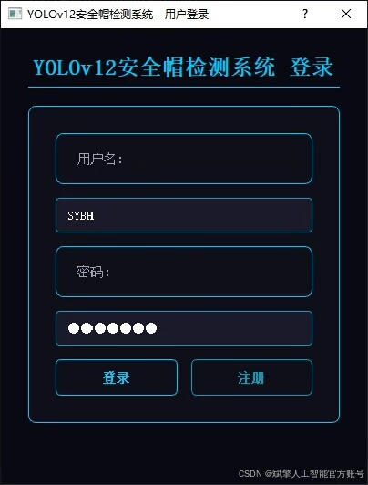
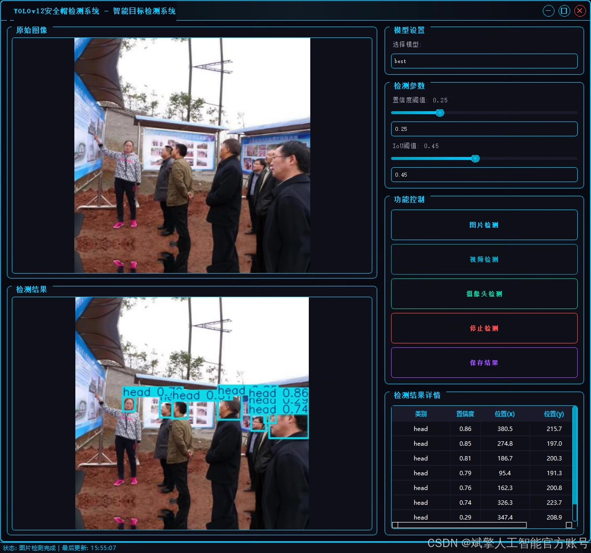
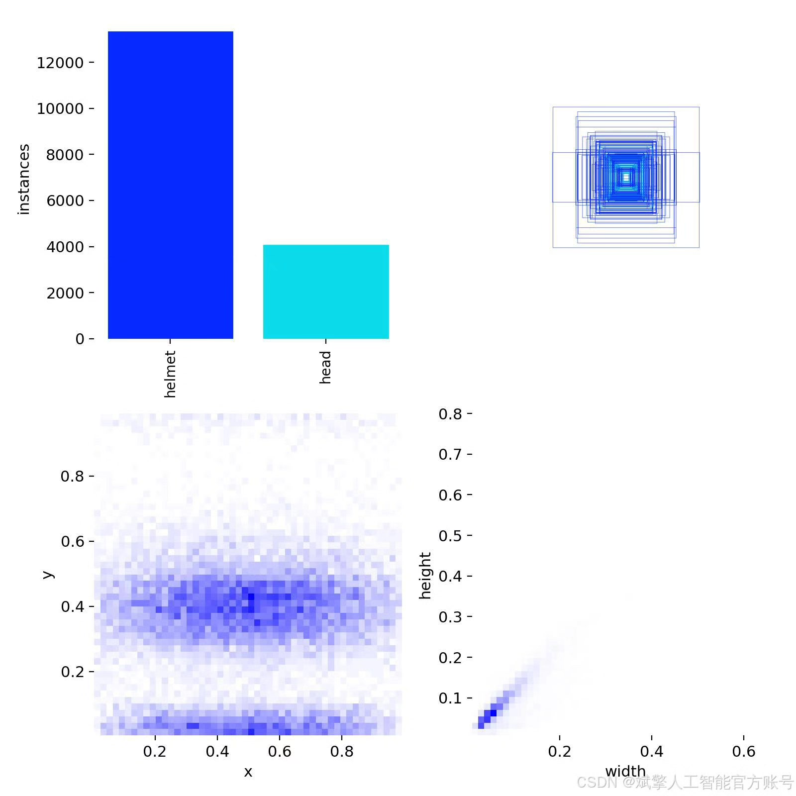
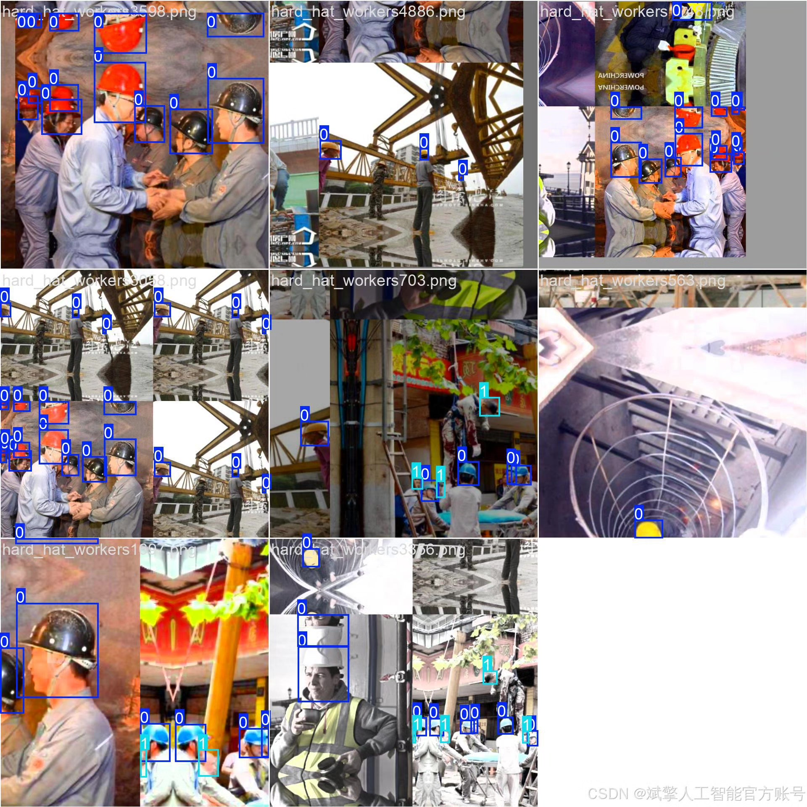
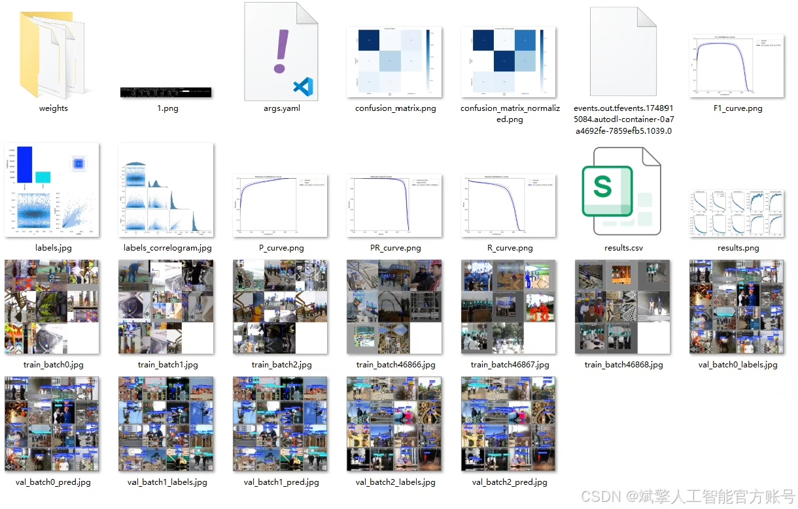
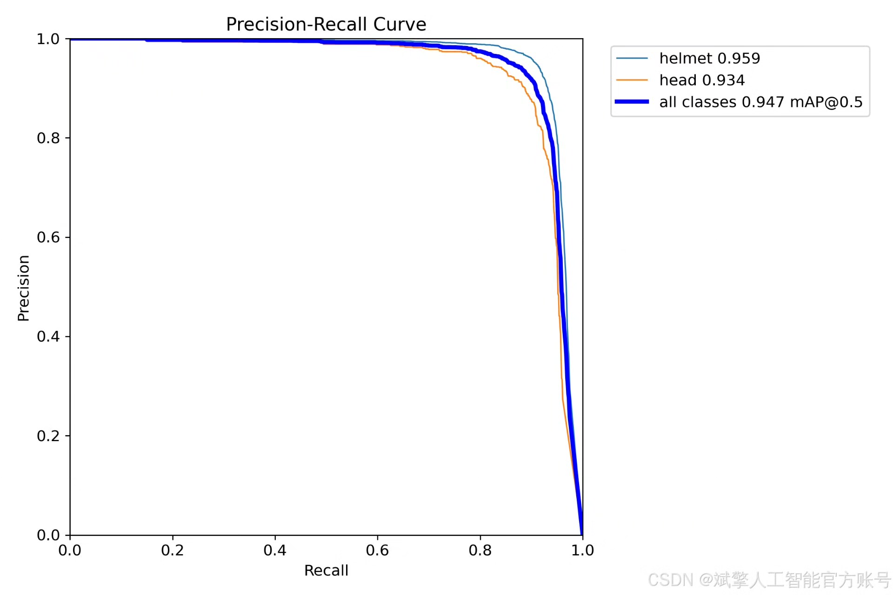
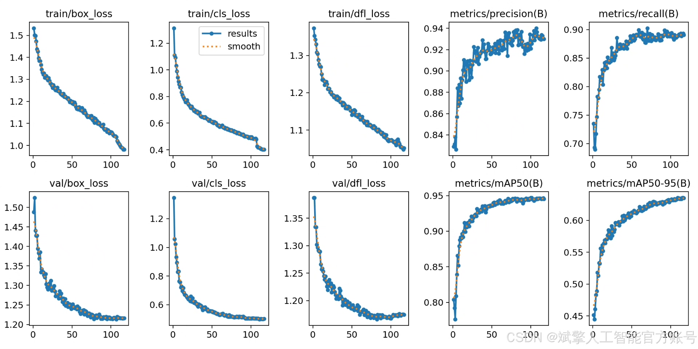
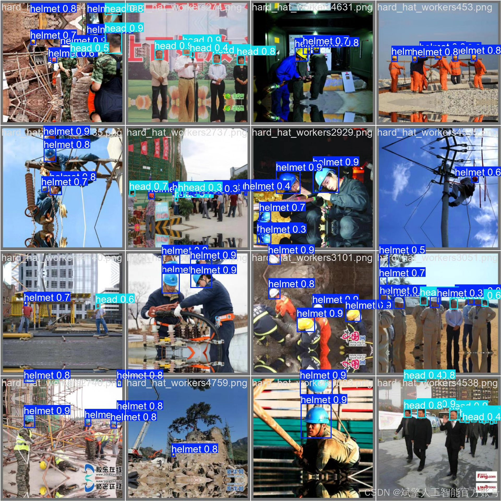

# YOLOv12 Safety Helmet Recognition System

## Body

YOLOv12 Safety Helmet Recognition System Based on Deep Learning YOLOv12: A High-Efficiency Safety Helmet Wearing Recognition System for Workplaces (YOLOv12+YOLO dataset + UI interface + login and registration interface + Python project source code + model)

This project has developed a highly efficient safety helmet detection system based on the YOLOv12 deep learning framework, specifically designed to identify the wearing of protective equipment in work environments. The system employs a two-class detection mode ('helmet' safety helmet and 'head' head), trained on a dataset of 5,000 labeled images (3,500 training set, 750 validation set, and 750 test set). This ensures high detection accuracy and generalization capability. The project includes complete Python implementation codes, pre-trained model parameters, and an integrated user-friendly UI interface that supports login and registration functions. This system can be widely applied in construction sites, factories, and other places requiring safety supervision, to monitor whether personnel are properly wearing safety helmets, effectively enhancing the level of safety production management. Experiments show that the model achieves high recognition accuracy on the test set, demonstrating good practical value.

✅ User Login and Registration: Supports password verification and security validation.
✅ Three Detection Modes: Based on the YOLOv12 model, supporting image, video, and real-time camera detection, accurately identifying targets.
✅ Dual-Screen Comparison: Display original images and detection results on the same screen.
✅ Data Visualization: Real-time table displaying the category, confidence, and coordinates of detected targets.
✅ Intelligent Parameter Tuning: Offers a confidence slide bar to dynamically optimize detection accuracy, adapting to different scene requirements.
✅ Sci-Fi Style Interactive Interface: Dark theme combined with dynamic light effects, reducing visual fatigue and improving operational experience.

## Images

## Payment

Here is a pay link on Stripe ( https://buy.stripe.com/3cs8yP7sY87d0vu9AB ). Please contact me lonlonago@foxmail.com after funding $89, and I will send you a complete data files , thank you!

